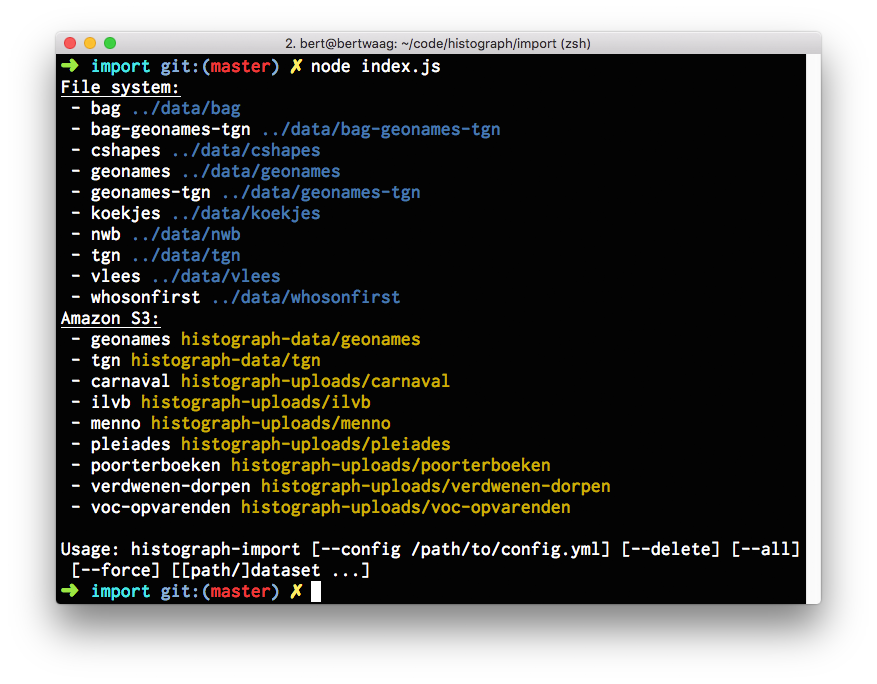

# histograph-import

histograph-import can bulk-import datasets from one or more directories (on the file system, and from [Amazon S3](https://aws.amazon.com/s3/)) containing multiple Histograph datasets.

## Installation

Easy:

    npm install -g histograph/import

## Usage

Also easy.

histograph-import expects a `import` section in the [Histograph configuration file](https://github.com/histograph/config):

```yaml
import:
  dirs:
    - /relative/or/absolute/path/to/directory/with/histograph/datasets
    - /Users/bert/Downloads/histograph-data
    - ...
  s3:
    region: eu-central-1
    accessKeyId: GOIAJD65FSXHQPBB3GIQ
    secretAccessKey: i4YUGs2a1p3aNKFc/y7gf6puyhy7LMi3WdA4WgGl
    buckets:
      - histograph-data
      - histograph-uploads

```

histograph-import expects each directory to contain a set of subdirectories containing data for one dataset. Each dataset subdirectory should contain a JSON file containing dataset metadata, and NDJSON files containing PITs, relations, or both. __Important__: histograph-import expects files to adhere to the following naming convention - files in the directory `dataset1` should be named `dataset1.dataset.json`, `dataset1.pits.ndjson` and `dataset1.relations.ndjson`.


Running `histograph-import` without arguments will list all available datasets, in the specified file system directories, and in each S3 bucket.



To import data into Histograph, run `histograph-import <dataset1> <dataset2> ...`. For example, you can run:

    histograph-import tgn

This will import the dataset with ID `tgn` into Histograph.

For information about the installation and usage of all of Histograph's components, see [histograph.io](http://histograph.io).

## Import all available datasets

To import all available datasets, run:

    histograph-import --all

## Remove datasets from Histograph

histograph-import can also remove datasets from Histograph.

To clear a selection of datasets, run:

    histograph-import --delete <dataset1> <dataset2> ...

To delete __all__ datasets:

    histograph-import --delete --all

## Force import

By default, the Histograph API [diffs](https://en.wikipedia.org/wiki/Diff_utility) each uploaded NDJSON file with the previous version (if present), and sends only changed items to the message queue for further processing. By supplying the `--force` parameter, also unchanged items are processed:

    histograph-import --force <dataset1> <dataset2> ...

Copyright (C) 2015 [Waag Society](http://waag.org).
