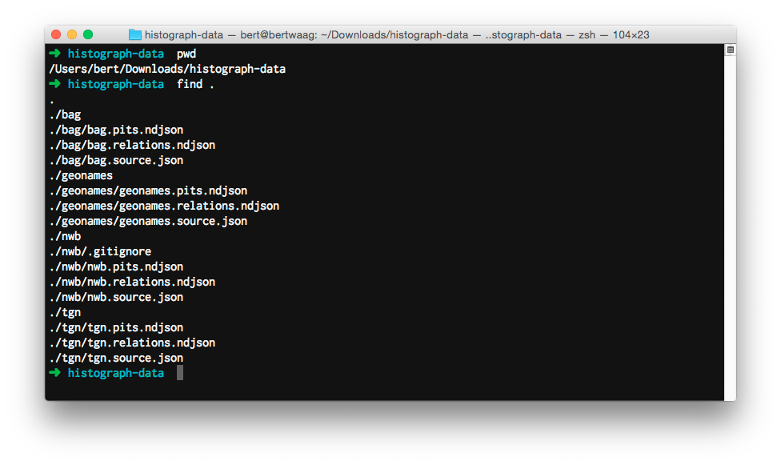

# histograph-import

histograph-import can bulk import source data from a directory containing multiple Histograph source data files.

## Installation

Easy:

    npm install -g histograph/import

## Usage

Also easy.

Create a [Histograph configuration file](https://github.com/histograph/config), and set the environment variable `HISTOGRAPH_CONFIG` to the absolute path of this file, for example:

    export HISTOGRAPH_CONFIG=/Users/bert/code/histograph/config/histograph.json

To use histograph-import, `histograph.json` should contain a section named `import` containing an array `dirs`:

```json
{
  "import": {
    "dirs": [
      "relative/or/absolute/path/to/directory/with/histograph/datasets",
      "/Users/bert/Downloads/histograph-data",
      "..."
    ]
  }
}
```

histograph-import expects each directory to contain a set of subdirectories containing data for one dataset. Each dataset subdirectory should contain a JSON file containing dataset metadata, and NDJSON files containing PITs, relations, or both. __Important__: histograph-import expects files to adhere to the following naming convention - files in the directory `dataset1` should be named `dataset1.source.json`, `dataset1.pits.ndjson` and `dataset1.relations.ndjson`.



Running `histograph-import` will import PITs and relations from all subdirectories of directory set in the configuration file. You can also run `node index.js <source1> <source2> ...` to only import a selection of data sources into Histograph. For example, you can run:

    histograph-import tgn

This will import only data from the subdirectory `tgn` into Histograph.

## Remove source(s) from Histograph

histograph-import can also remove sources from Histograph.

To clear __all__ sources:

    histograph-import --clear

To clear a selection of sources, run

    histograph-import --clear <source1> <source2> ...

## License

The source for Histograph is released under the GNU General Public License as published by the Free Software Foundation, either version 3 of the License, or (at your option) any later version.
